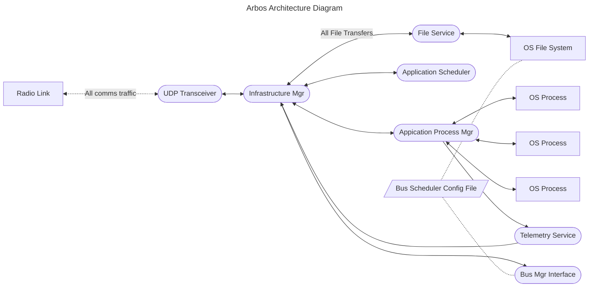
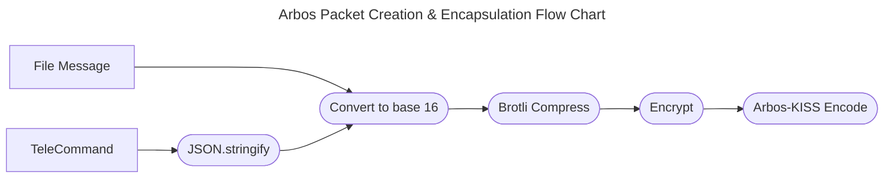

# Arbos KISS:

## Structure
| Byte(s) | Description | Notes |
|---|---|---|
| 0 | Start Byte | `C0` |
| 1-2 | Increment Bytes | See below |
| 3-n | Data | KISS Encoded |
| n+1 | Stop Byte | `C0` |

## Calculate Increment Bytes
Data sent with Arbos must be segmented into a size that would be able to fit into an IPV4 UDP packet.
```
65507       Max size of data field in UDP over IPV4
-   4       Start Byte + Stop Byte + 2 Increment Bytes
-----
65503       Max data size of a discrete Arbos packet
```
Most transfers will not exceed that size; however, in the unlikely case that they do, Arbos uses the Increment Bytes to indicate to the receiver that a single packet does not contain all the needed data, as well as describing the order in which the data should be read.

| 0 1 2 3 4 5 6 7 0 1 | 2 3 4 | 5 6 7 |
|---|---|
| Message index 1 - 1024 | Message segment 0 - 7 | Number of segments 2 - 7 |

Using this system, the maximum single message size is 524,024 bytes (8 messages of 65,503 bytes). The sender may send up to 1,024 of those messages during a single pass window. (Ground and Remote will maintain their own seperate counts.)

A packet that fits entirely in the Arbos packet maximum size (which will likely be most packets) should have all zeroes in the Increment Bytes.

# Arbos Architecture and Overview

## UDP Transceiver
The UDP Transceiver receives any UDP packets from the Radio Link. It is essentially a relay between the Radio Link and the Infrastructure Manager.

## Infrastructure Manager
This is the real "brains of the operation". It receives and parses all incoming data transmissions. There are two types of transmissions in the Arbos ecosystem: File Packets and Command Packets.

### File Packets
File Packets are handled by the File Service. This will store files received on the local file system. Likely scenarios for receiving files are config files for applications, application schedules, bus schedules, Arbos update files.

### Command Packets
Command Packets are handled by

---
## Basic Arbos Telecommands and their responses
`list_fs`: List the file system at the OS root
    - output similar to `ls -la`
`list_fs_at`: List the file system at the specified root
    - output similar to `ls -la`
`mv`: Move a file or directory within the onboard file system
    - `REMOTE_SUCCESS` message
`cp`: Copy a file or directory within the onboard file system
    - `REMOTE_SUCCESS`
`exec`: Run the provided command at the provided location
    - command output or `REMOTE_SUCCESS` message
`exec&`: Run the provided command in the background
    - `RUNNING` message with the command's process ID as the payload
    - the output of the command or a REMOTE_SUCCESS message with the process ID as the payload
`macro`: Create a macro with the provided entries
    - `REMOTE_SUCCESS` message with the macro name and the new total count of macros as payload
`downlink`: Downlink the file at the provided location
`uplink`: Instruct the file service to initiate an uplink request to the file client (this is not necessary, the file client can also initiate an uplink request from the ground. See the file protocol for details.)
`update_arbos`: Run the Arbos update script
`update_os`: Run the OS update script
`register_app`: Registers an application or executable as one that can be run by the Arbos system
`rotate_encryption_key`: Update the encryption key
`initialize_pass`: Inform the remote system of the pass type, details, and priorities

6 Arbos pass types:
* Update pass (and continued)
* Data pass (and continued)
* Status pass
* Responsive pass

### Update (and Update Continued)
This task describes what is usually a long-running task sending file data from the ground to the satellite. The updated may be an OS update, an Arbos update, an application config file update, an application schedule update, a bus schedule update, or an arbitrary update.

Update Types:
- OS
- Arbos
- Application Config
- Application Schedule
- Bus Schedule
- Arbitrary

All update tasks are assigned an ID. An Update Continued task will have both its own ID and a `continues` ID that references the original Update task's ID. An Update Continued task will be used if the update was not fully completed during the original pass window.

An update pass will have an `actions_on_complete` field which will be an ordered list of telecommands to execute once the update is complete. This list will be executed sequentially.


Typical operations flow:
1. A satellite pass begins.
2.

