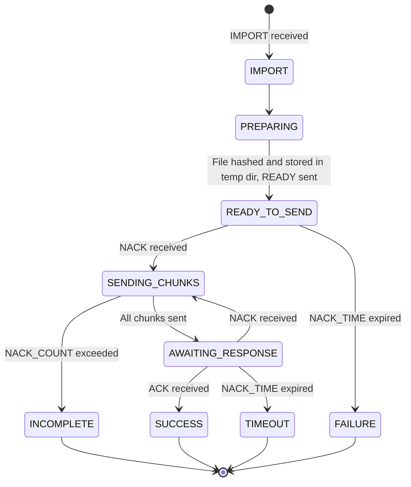

# File Protocol

The File Protocol is a system involving a point-to-point transfer of files that may be initiated by either point. In the Arbos system, the points are considered to be Ground and Remote. The transfer is conducted using a series of the following messages:

| Message Type | Message Value | Meaning | Composition |
| --- | --- | --- | --- |
| ACK | `0` | "I have received all the file chunks you said you would send" | `[<channel_id>, 0, <file_hash>]` |
| IMPORT | `1` | "I want you to send me the file at the path described" | `[<channel_id>, 1, <path to requested file>]` |
| EXPORT | `2` | "I want to send you the file described in this message" | `[<channel_id>, 2, <file_hash>, <number_of_chunks>, <file_name_or_path>]` |
| ERROR | `6` | "I received an unexpected or out-of-order message" | `[<channel_id>, 6, <error_string>]` |
| DONE | `4` | "I have sent all the file data you requested and I believe there is no more work to do" | `[<channel_id>, 4, <file_hash>]` |
| DATA | `5` | "Here is a chunk of the file" | `[<channel_id>, 5, <file_hash>, <index>, <...data>]` |
| NACK | `7` | "I am missing the listed file chunks at the indexes provided" | `[<channel_id>, 7, <file_hash>, <...index_pairs>]` |

